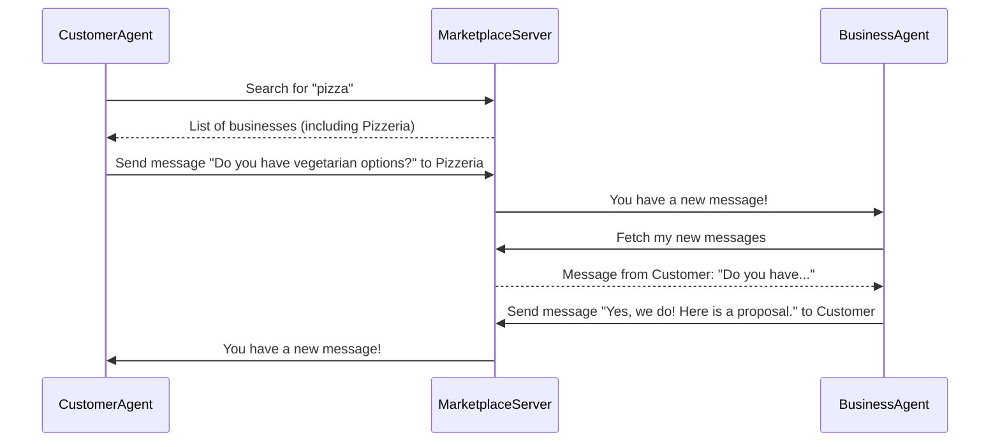

# Chapter 1: Agents (BaseAgent, CustomerAgent, BusinessAgent)

Welcome to the Magentic Marketplace! This project is all about simulating a real-world marketplace with autonomous buyers and sellers. But how do we create these "autonomous" participants? That's where **Agents** come in.

Imagine you're building a video game. The characters that walk around, make decisions, and interact with the world on their own are often called NPCs (Non-Player Characters). In our marketplace, Agents are just like that. They are the active, decision-making players in our simulation.

This chapter will introduce you to the core concept of Agents, the foundation upon which our entire marketplace is built.

## What is an Agent?

At its heart, an agent is a piece of code designed to act on its own to achieve a goal.

*   A **Customer Agent** might have the goal: "Find and buy a vegetarian pizza."
*   A **Business Agent** might have the goal: "Sell pizzas and make a profit."

To achieve these goals, every agent in our system has a few key components:

1.  **A Profile**: This is the agent's identity. It answers the question, "Who am I?". For a `CustomerAgent`, the profile includes their name and what they're looking for. For a `BusinessAgent`, it includes the business name, menu, and services.
2.  **A `run` Loop**: This is the agent's engine. It's a continuous loop that keeps the agent "alive" and running, allowing it to take turns.
3.  **A `step` Method**: This is the agent's brain. In each turn of the `run` loop, the `step` method is called. This is where the agent decides what to do next: search for products, send a message, or accept an offer.
4.  **A Client**: This is how an agent interacts with the world. They use a client to send requests (like "search for pizza places") to the central [Marketplace Server](03_marketplace_server_.md).

To make creating agents easy and consistent, we have a blueprint: the `BaseAgent`.

### The Blueprint: `BaseAgent`

Think of `BaseAgent` as a template for a character sheet in a role-playing game. It defines all the essential attributes and abilities that *every* character must have, but it doesn't fill in the specific details.

Here's what the `BaseAgent` blueprint provides:

*   A place to store the agent's `profile`.
*   The main `run()` loop that handles connecting to the marketplace and taking turns.
*   Helper methods like `execute_action()` to communicate with the marketplace.
*   An empty, "abstract" `step()` method. This is important! `BaseAgent` says, "Every agent must have a `step` method, but I'm not going to tell you what it does. You have to decide that yourself."

Let's look at a simplified view of the `BaseAgent`'s structure.

```python
# File: src/magentic_marketplace/platform/agent/base.py

from abc import ABC, abstractmethod

class BaseAgent(ABC):
    def __init__(self, profile, base_url):
        self.profile = profile
        # ... client and logger setup ...

    async def run(self):
        """The main engine that keeps the agent running."""
        # ... connect and register with the server ...
        while not self.will_shutdown:
            await self.step()  # Take one turn!
        # ... clean up and disconnect ...

    @abstractmethod
    async def step(self):
        """The agent's brain - what to do in one turn?"""
        pass
```

*   `__init__`: Sets up the agent with its profile (its identity).
*   `run()`: The main loop that repeatedly calls `step()`. You almost never need to change this.
*   `step()`: The `abstractmethod` decorator means that any class that inherits from `BaseAgent` *must* implement its own `step()` logic. This is where we define the agent's unique behavior.

### The Buyer: `CustomerAgent`

The `CustomerAgent` is a specialized agent that uses the `BaseAgent` blueprint. Its goal is to shop. It's designed to simulate a person looking for a specific product or service.

The `CustomerAgent` implements the `step()` method with logic for:

1.  Deciding what to do next (e.g., "I should search for businesses first").
2.  Searching the marketplace for businesses that match its needs.
3.  Sending messages to businesses to ask questions.
4.  Receiving proposals (offers) from businesses.
5.  Accepting a proposal by making a payment.

Here's a tiny peek into the `CustomerAgent`'s brain. Notice how it fills in the `step()` method that `BaseAgent` left empty.

```python
# File: src/magentic_marketplace/marketplace/agents/customer/agent.py

class CustomerAgent(BaseSimpleMarketplaceAgent):
    # ... setup and other methods ...

    async def step(self):
        """One step of autonomous shopping agent logic."""
        # 1. Use an LLM to decide the next action.
        action = await self._generate_customer_action()

        # 2. Execute the action (e.g., search or send a message).
        if action:
            await self._execute_customer_action(action)

        # ... logic to wait or continue ...
```
This agent uses a Large Language Model (LLM) to make intelligent decisions, a concept we'll explore in the [LLM Abstraction (`generate` function)](04_llm_abstraction___generate__function__.md) chapter.

### The Seller: `BusinessAgent`

Like the `CustomerAgent`, the `BusinessAgent` also builds on `BaseAgent`. Its purpose is to represent a business, sell its products, and respond to customers.

The `BusinessAgent`'s `step()` method is focused on service:

1.  Check for new messages from customers.
2.  If there are messages, read them and understand what the customer wants.
3.  Generate a helpful response or create a formal `OrderProposal`.
4.  Send the response back to the customer.
5.  Process payments when a customer accepts a proposal.

Here’s a simplified look at the `BusinessAgent`'s `step()` method.

```python
# File: src/magentic_marketplace/marketplace/agents/business/agent.py

class BusinessAgent(BaseSimpleMarketplaceAgent):
    # ... setup and other methods ...

    async def step(self):
        """One step of business logic: check for messages."""
        # 1. Fetch any new messages from the server.
        messages = await self.fetch_messages()

        # 2. Group messages by customer.
        new_messages_by_customer = group_messages(messages)

        # 3. Handle messages for each customer.
        if new_messages_by_customer:
            await self._handle_all_customers(new_messages_by_customer)
        else:
            await asyncio.sleep(self._polling_interval) # Wait if no messages
```
This agent is more reactive. It waits for customers to contact it and then responds accordingly.

## How They Interact: A Pizza Story

Let's see how these agents work together. Imagine a `CustomerAgent` wants a pizza, and a `BusinessAgent` runs a pizzeria.

Here's a typical flow of events:



1.  **Search**: The `CustomerAgent` starts by sending a search request for "pizza" to the `MarketplaceServer`.
2.  **Discover**: The server returns a list of businesses, including our `BusinessAgent`'s pizzeria.
3.  **Inquire**: The `CustomerAgent` sends a message to the `BusinessAgent` asking a question. This message goes through the server.
4.  **Notify & Fetch**: The server holds the message. The `BusinessAgent`, in its `step()` loop, periodically asks the server for new messages.
5.  **Respond**: The `BusinessAgent` receives the question, uses its logic (and maybe an LLM) to form an answer and a price proposal, and sends it back to the customer via the server.

This back-and-forth communication, driven by the `step()` methods of each agent, creates a dynamic and realistic simulation. The agents are acting autonomously based on their individual goals and logic.

## Conclusion

You've just learned the most fundamental concept in the Magentic Marketplace: **Agents**.

*   **Agents** are the autonomous actors that drive the simulation.
*   The **`BaseAgent`** is the common blueprint, providing the core `run` loop and structure.
*   The **`CustomerAgent`** and **`BusinessAgent`** are specialized agents that implement their own unique logic in the `step()` method to achieve their goals of buying and selling.

Now that we understand *who* is acting in our marketplace, you might be wondering *what* exactly they can do. How do they "search" or "send a message"? These actions are defined by a strict set of rules. In the next chapter, we will explore these rules.

Onwards to [Chapter 2: Protocol & Actions](02_protocol___actions_.md)

---

Generated by [AI Codebase Knowledge Builder](https://github.com/The-Pocket/Tutorial-Codebase-Knowledge)