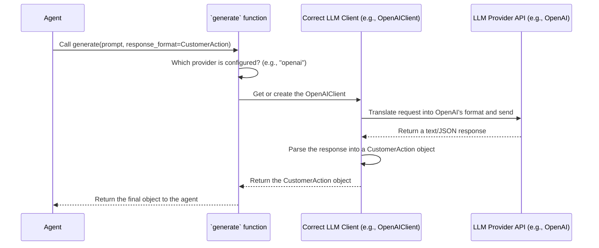

# Chapter 4: LLM Abstraction (`generate` function)

In the [previous chapter](03_marketplace_server_.md), we explored the `MarketplaceServer`, the central hub that receives requests from our agents. We saw how agents send structured requests, like "search" or "send message", to the server.

But how does an agent *decide* which action to take in the first place? A `CustomerAgent` looking for pizza can't just follow a rigid script. It needs to think, react to new information (like messages from a business), and make intelligent decisions. This is where we give our agents a "brain" powered by Large Language Models (LLMs).

This chapter introduces the `generate` function, the simple yet powerful tool that connects our agents to the world of AI.

## The Universal Remote for LLMs

Imagine you have three different TVs in your house: a Sony, a Samsung, and an LG. Each one comes with its own remote control, and the buttons are all in different places. It's confusing to switch between them. What you really want is a single universal remote that can control all three TVs with one simple interface.

Large Language Models (LLMs) are like those different TVs. There are many providers: OpenAI (with GPT-4), Anthropic (with Claude), Google (with Gemini), and more. Each has its own way of being called (its own "API"). If we wrote our agent's logic to specifically talk to OpenAI, it would be a lot of work to switch to Anthropic later. We'd have to rewrite the agent's brain!

The `generate` function is our **universal remote**. It provides a single, simple way for our agents to talk to *any* LLM, without needing to know the specific details.

This solves a huge problem: it keeps our agent's decision-making logic clean and separate from the underlying LLM service. We can switch the LLM provider with a simple configuration change, and the agent's code doesn't have to change at all.

## Using the `generate` Function

Our agents use the `generate` function for two main tasks:
1.  Generating simple, plain text.
2.  Generating structured data that follows a specific format.

Let's see how easy it is to use.

### Use Case 1: Generating Plain Text

Imagine our `BusinessAgent` receives a payment and wants to send a thank-you message. It needs to generate a friendly, human-like response.

Here's how it could use `generate` to do that:

```python
# A simplified example of generating a thank you message
from magentic_marketplace.marketplace.llm import generate

prompt = "Write a short, friendly message confirming a customer's payment."
response_text, usage_info = await generate(prompt)

print(response_text)
```

**What happens here?**
1.  We define a `prompt`, which is our instruction to the LLM.
2.  We call `await generate(prompt)`.
3.  The function sends our prompt to the configured LLM (e.g., GPT-4).
4.  The LLM generates a response, which comes back as a simple string.

The output `response_text` would be something like:

> "Thank you for your payment! Your order is confirmed and will be processed shortly."

This is useful, but the real power of `generate` comes from its ability to produce more than just text.

### Use Case 2: Generating Structured Data

Our agents don't just chat; they need to make decisions that translate into specific [Actions](02_protocol___actions_.md), like `Search` or `SendMessage`. Getting plain text back from an LLM like "I think I will search for pizza places now" is hard for a program to understand.

It would be much better if the LLM could directly give us a structured object, like filling out a form for us. This is where `generate` shines.

Let's look at the `CustomerAgent`. In its `step()` loop, it needs to decide what to do next. We've defined all possible decisions in a Pydantic model called `CustomerAction`.

```python
# File: src/magentic_marketplace/marketplace/agents/customer/models.py

from pydantic import BaseModel

class CustomerAction(BaseModel):
    """An action that the customer can take."""
    action_type: str  # e.g., "search_businesses", "send_messages"
    reason: str       # The LLM's reason for choosing this action
    # ... other fields for search queries or messages ...
```

Now, we can ask the `generate` function to fill out this `CustomerAction` "form" for us by passing the class as the `response_format`.

```python
# File: src/magentic_marketplace/marketplace/agents/customer/agent.py (simplified)
from .models import CustomerAction

# ... inside the CustomerAgent ...
async def _generate_customer_action(self) -> CustomerAction:
    # ... build a detailed prompt about the agent's current situation ...
    full_prompt = "Given your goal and history, what is your next action?"
    
    action, _ = await self.generate_struct(
        prompt=full_prompt,
        response_format=CustomerAction,
    )
    return action
```

**What's happening here is almost magical:**
1.  We give `generate` the same kind of text prompt as before.
2.  But this time, we add `response_format=CustomerAction`. This tells the function: "Don't just give me text. I need you to return an object that perfectly matches the structure of the `CustomerAction` class."
3.  The `generate` function uses special techniques to make the LLM output a structured JSON that it then automatically parses into a `CustomerAction` object.

The `action` variable is not a string; it's a full-fledged Python object that we can use directly in our code! This makes the agent's logic incredibly clean and reliable.

## Under the Hood: How `generate` Works

So how does our "universal remote" actually work? Let's follow a request from an agent to the LLM and back.

The process involves a few key steps: figuring out which "TV" to talk to, finding the right "remote" for it, and translating the simple request into the specific buttons that remote needs.



1.  **Agent Call**: The agent calls `generate` with its instructions.
2.  **Provider Routing**: The `generate` function first checks the configuration to see which LLM provider we want to use (e.g., "openai", "anthropic").

    ```python
    # File: src/magentic_marketplace/marketplace/llm/functional.py (simplified)
    
    async def generate(...):
        # ... figures out the config based on parameters and environment variables ...
        config = ConcreteConfigAdapter.validate_python(config_kwargs)

        # This is the router! It picks the right client for the job.
        match config.provider:
            case "openai":
                client = OpenAIClient.from_cache(config)
            case "anthropic":
                client = AnthropicClient.from_cache(config)
            # ... and so on for other providers
    ```
    This `match` statement is the core of the router. It looks at the provider name and selects the correct "specialized remote" (the client) for that provider.

3.  **Client Translation**: Each client, like `OpenAIClient`, knows exactly how to talk to its specific API. It takes the generic arguments (like `prompt` and `response_format`) and translates them.

    ```python
    # File: src/magentic_marketplace/marketplace/llm/clients/openai.py (simplified)

    class OpenAIClient(ProviderClient[OpenAIConfig]):
        async def _generate(self, messages, response_format, **kwargs):
            # If a response_format is given, use OpenAI's "tool calling" feature
            if response_format is not None:
                # This call is specific to the OpenAI library!
                response = await self.client.chat.completions.parse(
                    response_format=response_format, messages=messages, **kwargs
                )
                # ... extract the parsed object from the response ...
                return parsed_object, usage_info
            else:
                # ... make a regular text-based API call ...
    ```
    This `OpenAIClient` handles all the messy details. If we ask for structured data (`response_format`), it uses a special OpenAI feature to get back reliable JSON, which it then parses into the Pydantic object we wanted. The agent never has to know that this is happening.

## Conclusion

You've just learned about the "brain" of our agents and the elegant abstraction that powers it.

*   The **`generate` function** acts as a universal remote, providing a single, simple interface to communicate with various Large Language Models.
*   It can be used to generate both **plain text** and, more importantly, **structured data objects** (like a `CustomerAction`).
*   This design **decouples** the agent's decision-making logic from the specific LLM provider, making our system flexible and easy to maintain.

We now have all the core pieces of our simulation: intelligent [Agents](01_agents__baseagent__customeragent__businessagent__.md), a central [Marketplace Server](03_marketplace_server_.md) to connect them, a strict [Protocol & Actions](02_protocol___actions_.md) for them to follow, and the `generate` function to power their decisions.

But how do we actually start everything up and run an experiment? In the next chapter, we'll look at the tools that let us configure and launch our marketplace simulation from the command line.

Onwards to [Chapter 5: Command-Line Interface (CLI) & Experiment Runners](05_command_line_interface__cli____experiment_runners_.md)

---

Generated by [AI Codebase Knowledge Builder](https://github.com/The-Pocket/Tutorial-Codebase-Knowledge)