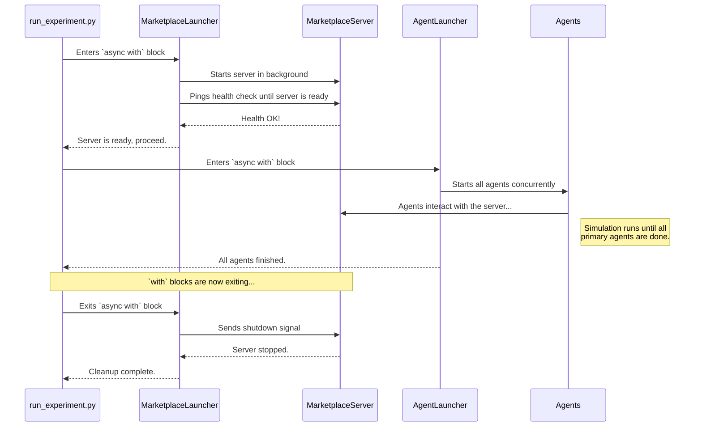

# Chapter 6: Launchers (MarketplaceLauncher & AgentLauncher)

In the [previous chapter](05_command_line_interface__cli____experiment_runners__.md), we saw how the Command-Line Interface (CLI) and Experiment Runners act as a mission control panel to start our simulations. We saw a script, `run_experiment.py`, that was responsible for preparing and launching everything.

But think about a real space mission. The launch sequence is incredibly complex and precise. You can't just press all the buttons at once. You must first power up the launchpad, then run system checks, then start the rocket engines, and only then, launch. After the mission, you need to shut everything down safely.

How do we manage this complex startup and shutdown sequence in our simulation without getting into a tangled mess? This is the job of our **Launchers**.

## Your Automated Launch Sequence

The Launchers are the high-level orchestrators that handle the entire lifecycle of a simulation. They ensure every component starts in the right order and is cleaned up properly afterward. Think of them as the automated launch sequence computer at mission control.

There are two main launchers working together:

1.  **`MarketplaceLauncher`**: This is the "Ground Control" launcher. Its job is to prepare the entire environment. It starts the [Marketplace Server](03_marketplace_server_.md), connects to the database, and performs health checks to ensure the "launchpad" is ready before any agents arrive.
2.  **`AgentLauncher`**: This is the "Rocket" launcher. Once the environment is ready, it takes the list of [Agents](01_agents__baseagent__customeragent__businessagent__.md) and launches them into the running marketplace, managing their lifecycle until their mission is complete.

Together, they provide a clean, reliable, and reusable way to start and stop a complete experiment.

## How to Use the Launchers

The launchers are designed to be used with a clean and powerful Python feature called an "async context manager" (`async with`). This syntax is like making a promise: "Do this setup stuff before my code runs, and no matter what happens, do this cleanup stuff after."

Let's look at a simplified version of our `run_experiment.py` script from the last chapter to see how they work together.

```python
# File: src/magentic_marketplace/experiments/run_experiment.py (simplified)

async def run_marketplace_experiment(...):
    # 1. Prepare Ground Control: Configure the environment launcher
    marketplace_launcher = MarketplaceLauncher(...)

    # 2. Start the environment and wait for it to be ready
    async with marketplace_launcher:
        # --- Inside this block, the server is guaranteed to be running! ---
        print("Server is up!")

        # 3. Prepare the agents
        customer_agents = [CustomerAgent(...) for c in customers]
        business_agents = [BusinessAgent(...) for b in businesses]

        # 4. Use the AgentLauncher to run them
        async with AgentLauncher(...) as agent_launcher:
            await agent_launcher.run_agents_with_dependencies(
                primary_agents=customer_agents,
                dependent_agents=business_agents,
            )

    # --- Outside this block, the server is guaranteed to be shut down. ---
    print("Simulation complete. Server is down.")
```

This structure is beautifully simple and safe.

*   The `async with marketplace_launcher:` block handles the server. When the code enters this block, the launcher automatically starts the server. When the code leaves the block (either normally or due to an error), it automatically stops the server.
*   Nested inside, the `async with AgentLauncher(...)` block handles the agents in the now-running environment.

### A Smarter Way to Run Agents

You might have noticed the special method `run_agents_with_dependencies`. This is a very important feature for our simulations. It solves a common problem: when should the simulation end?

In our marketplace, the simulation is driven by the customers. When all the customers have either bought what they want or given up, the experiment is over. The businesses are just there to react.

`run_agents_with_dependencies` understands this relationship:
*   `primary_agents` (our customers): These are the main actors. The launcher will wait for all of them to finish their `run()` loop.
*   `dependent_agents` (our businesses): These agents will run as long as the primary agents are active. As soon as the last customer finishes, the launcher will automatically tell all the businesses to shut down gracefully.

This gives us a clean, automatic way to end the simulation without needing a manual timer or complex shutdown logic.

## Under the Hood: The Launch Sequence

So what's happening behind the scenes when we use these `async with` blocks? Let's follow the entire process from start to finish.



This diagram shows the perfect, orderly sequence. The `MarketplaceLauncher` acts as a guard, refusing to let the code proceed until the server is confirmed to be healthy. Then, once everything inside its block is finished, it ensures a clean shutdown.

### Inside the `MarketplaceLauncher`

The `async with` magic is implemented with two special methods: `__aenter__` (for setup) and `__aexit__` (for cleanup).

```python
# File: src/magentic_marketplace/platform/launcher.py (simplified)

class MarketplaceLauncher:
    # ... __init__ sets up configuration ...

    async def __aenter__(self):
        """Async context manager entry: start the server."""
        await self.start_server()
        return self

    async def __aexit__(self, exc_type, exc_val, exc_tb):
        """Async context manager exit: stop the server."""
        await self.stop_server()
```
*   When you write `async with marketplace_launcher:`, Python automatically calls `__aenter__`.
*   The `start_server()` method doesn't just start the server; it also repeatedly pings the server's health check endpoint until it gets a successful response. This prevents a race condition where agents might try to connect before the server is fully booted up.
*   When the block finishes, Python calls `__aexit__`, which in turn calls `stop_server()` to perform the cleanup.

### Inside the `AgentLauncher`

The `AgentLauncher`'s `run_agents_with_dependencies` method uses `asyncio`, Python's library for running code concurrently.

```python
# File: src/magentic_marketplace/platform/launcher.py (simplified)

class AgentLauncher:
    async def run_agents_with_dependencies(
        self, primary_agents, dependent_agents
    ):
        # 1. Start all agents as concurrent tasks
        primary_tasks = [asyncio.create_task(agent.run()) for agent in primary_agents]
        dependent_tasks = [asyncio.create_task(agent.run()) for agent in dependent_agents]

        # 2. Wait ONLY for the primary agents (customers) to complete
        await asyncio.gather(*primary_tasks)
        print("All primary agents completed")

        # 3. Signal dependent agents (businesses) to shutdown
        for agent in dependent_agents:
            agent.shutdown()

        # 4. Wait for dependent agents to finish their cleanup
        await asyncio.gather(*dependent_tasks)
        print("All dependent agents shut down gracefully")
```
This is the heart of the orchestration:
1.  All agents are started at the same time using `asyncio.create_task`.
2.  `asyncio.gather` is used to pause and wait. Crucially, it first waits only for the `primary_tasks`.
3.  Once the customers are done, it loops through the `dependent_agents` and calls their `shutdown()` method. This sets an internal flag inside each business agent, telling it to stop its `run` loop.
4.  Finally, it calls `asyncio.gather` on the `dependent_tasks` to wait for them to finish their graceful shutdown process.

## Conclusion

You've just learned about the crucial orchestrators that make our complex simulations manageable and reliable.

*   **Launchers** automate the complex startup and shutdown sequence of our marketplace experiments.
*   The **`MarketplaceLauncher`** is responsible for the environment: it starts and stops the server and database, ensuring they are ready before anything else happens.
*   The **`AgentLauncher`** is responsible for the actors: it launches the agents and manages their lifecycle, using a smart dependency system to know when the simulation should end.
*   The `async with` syntax provides a clean, safe, and readable way to use these launchers.

The `MarketplaceLauncher` plays a key role in setting up the environment, including getting the database ready. But what exactly is this database, and how do we interact with it to save and retrieve all the messages, actions, and logs from our simulation?

In the next chapter, we'll dive into the final core component: the central memory of our marketplace.

Onwards to [Chapter 7: Database Controller](07_database_controller_.md)

---

Generated by [AI Codebase Knowledge Builder](https://github.com/The-Pocket/Tutorial-Codebase-Knowledge)