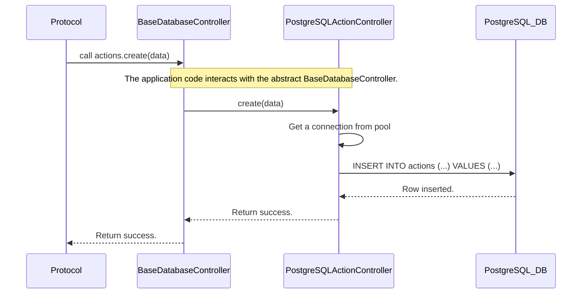

# Chapter 7: Database Controller

Welcome to the final chapter! In the [previous chapter](06_launchers__marketplacelauncher___agentlauncher__.md), we learned how the `MarketplaceLauncher` and `AgentLauncher` work together to orchestrate the startup and shutdown of our entire simulation. The `MarketplaceLauncher` is responsible for preparing the environment, including getting the database ready.

But what exactly is this database, and how does it work? Every simulation generates a mountain of data: every agent registration, every message sent, every action taken, every thought process logged. To analyze an experiment, we need a reliable way to record all of this history. This is the job of the **Database Controller**.

## The Simulation's Official Historian

Imagine our simulation is like an airplane's flight. After the flight is over, engineers need to look at the "black box" to see exactly what happened—every turn, every change in altitude, every communication. The Database Controller is our simulation's black box. It's the official historian that meticulously records every event.

But there are many different kinds of databases, like PostgreSQL, SQLite, MySQL, etc. Each one "speaks" a slightly different language (SQL dialect). If we wrote our code to talk directly to PostgreSQL, it would be very difficult to switch to SQLite later for a simpler, file-based setup. We'd be "locked in" to one technology.

The Database Controller solves this by acting as a universal translator. It provides a single, consistent way for our application to talk about saving and retrieving data, hiding the messy details of which specific database is actually doing the work.

## The Blueprint for a Historian: `BaseDatabaseController`

The core of our solution is a blueprint called `BaseDatabaseController`. Think of it as a job description for a historian. It doesn't say *who* the historian is, but it defines what any historian working for us *must* be able to do.

The job description includes tasks like:
*   "You must have a department for managing agent records (`.agents`)."
*   "You must have a department for managing action records (`.actions`)."
*   "Within each department, you must know how to `create` a new record, `get` a record by its ID, and `find` records that match a specific query."

Let's look at the abstract blueprint.

```python
# File: src/magentic_marketplace/platform/database/base.py

class BaseDatabaseController(ABC):
    @property
    @abstractmethod
    def agents(self) -> AgentTableController:
        """Get the agent controller."""
        pass

    @property
    @abstractmethod
    def actions(self) -> ActionTableController:
        """Get the Action controller."""
        pass
    # ... and so on for logs ...
```
This code defines the contract. Any class that claims to be a `BaseDatabaseController` *must* provide a way to access an `agents` controller and an `actions` controller.

This simple idea allows the rest of our application to be blissfully ignorant of the details. It can ask the historian to save an action without needing to know if that historian writes things down in a high-tech PostgreSQL server or a simple SQLite file.

### The Departments: `TableController`

Each "department" (`.agents`, `.actions`) is also based on a blueprint, the `TableController`. This is a generic contract for managing a single type of data.

```python
# File: src/magentic_marketplace/platform/database/base.py

class TableController(ABC, Generic[TableEntryType]):
    @abstractmethod
    async def create(self, item: TableEntryType) -> TableEntryType:
        """Create a new item in the Table."""
        pass

    @abstractmethod
    async def get_by_id(self, item_id: str) -> TableEntryType | None:
        """Retrieve an item by its ID."""
        pass
    # ... and methods for find, update, delete ...
```
This ensures that every data table in our system can be interacted with in the exact same way.

## How it's Used: Saving an Action

Let's revisit a key moment in our simulation: the [Protocol & Actions](02_protocol___actions_.md) module has received a `SendMessage` action and needs to execute it. Part of "executing" it means saving a record of it.

Here's how the protocol uses the Database Controller to do this.

```python
# A simplified function from the protocol logic

async def execute_send_message(
    parsed_action: SendMessage, 
    database: BaseDatabaseController  # Notice the type hint!
):
    # 1. Create a row object to be saved
    action_row = ActionRow(
        id=str(uuid.uuid4()),
        created_at=datetime.now(timezone.utc),
        data=ActionRowData(agent_id=..., request=..., result=...),
    )

    # 2. Ask the database to save it
    await database.actions.create(action_row)

    # ... return success
```
This is the beauty of the abstraction in action.
1.  The function takes an argument `database` and knows only that it's some kind of `BaseDatabaseController`. It has no idea if it's PostgreSQL or SQLite.
2.  It calls `database.actions.create(...)`. It's using the standard "historian" interface, trusting that whatever database is plugged in will know how to handle the request.

## Under the Hood: From Blueprint to Reality

So what happens when `database.actions.create()` is called? The request is passed from the general blueprint to the specific, concrete implementation that was configured when the application started.

This diagram shows how the call is delegated to the real database worker.


The Protocol's request is seamlessly routed to the `PostgreSQLActionController`, which contains the actual SQL code needed to talk to a PostgreSQL database.

### The Concrete Implementations

Let's look at how a concrete class like `PostgreSQLDatabaseController` fulfills the contract from the blueprint.

```python
# File: src/magentic_marketplace/platform/database/postgresql/postgresql.py

class PostgreSQLDatabaseController(BaseDatabaseController):
    def __init__(self, connection_pool, ...):
        # Create the specific "departments" for PostgreSQL
        self._actions = PostgreSQLActionController(connection_pool, ...)
        # ... and for agents, logs, etc. ...

    @property
    def actions(self) -> ActionTableController:
        """This fulfills the contract!"""
        return self._actions
```
This class creates an instance of `PostgreSQLActionController` and returns it when the `.actions` property is accessed. This is how the "blueprint" gets connected to a "real building."

And inside that `PostgreSQLActionController` is where the database-specific logic finally lives.

```python
# File: src/magentic_marketplace/platform/database/postgresql/postgresql.py

class PostgreSQLActionController(...):
    async def create(self, item: ActionRow) -> ActionRow:
        # Get a connection to the database
        async with self.connection(is_write=True) as conn:
            # Execute a PostgreSQL-specific SQL command
            await conn.execute(
                f"INSERT INTO {self._schema}.actions (id, data) VALUES ($1, $2)",
                item.id,
                item.data.model_dump_json(),
            )
        # ... return the created item ...
```
This `create` method contains the actual `INSERT` statement. This is the nitty-gritty detail that our abstraction successfully hides from the rest of the application. If we wanted to support SQLite, we would create a `SQLiteActionController` with a slightly different `create` method, but the rest of the application code would remain unchanged.

## Conclusion

And with that, you have learned about the final core component of the Magentic Marketplace!

*   The **Database Controller** is the abstraction for data persistence, acting as the simulation's official historian.
*   The **`BaseDatabaseController`** defines a common interface (a contract) for how to interact with any database.
*   **Concrete implementations** like `PostgreSQLDatabaseController` and `SQLiteDatabaseController` contain the specific logic for talking to a particular database technology.
*   This design makes our application **flexible and decoupled**, allowing us to easily switch database backends without rewriting our core logic.

Congratulations! You have journeyed through all the major components of the `magentic-marketplace` project. You've met the autonomous [Agents](01_agents__baseagent__customeragent__businessagent__.md), learned the [Protocol & Actions](02_protocol___actions_.md) they follow, seen the central [Marketplace Server](03_marketplace_server_.md) that connects them, understood the [LLM Abstraction (`generate` function)](04_llm_abstraction___generate__function__.md) that powers their brains, used the [CLI & Experiment Runners](05_command_line_interface__cli____experiment_runners_.md) to launch simulations, and seen how the [Launchers](06_launchers__marketplacelauncher___agentlauncher__.md) and **Database Controller** manage the simulation's lifecycle and memory.

You are now fully equipped to explore the code, run your own experiments, and even start building new agents and scenarios. Happy simulating

---

Generated by [AI Codebase Knowledge Builder](https://github.com/The-Pocket/Tutorial-Codebase-Knowledge)