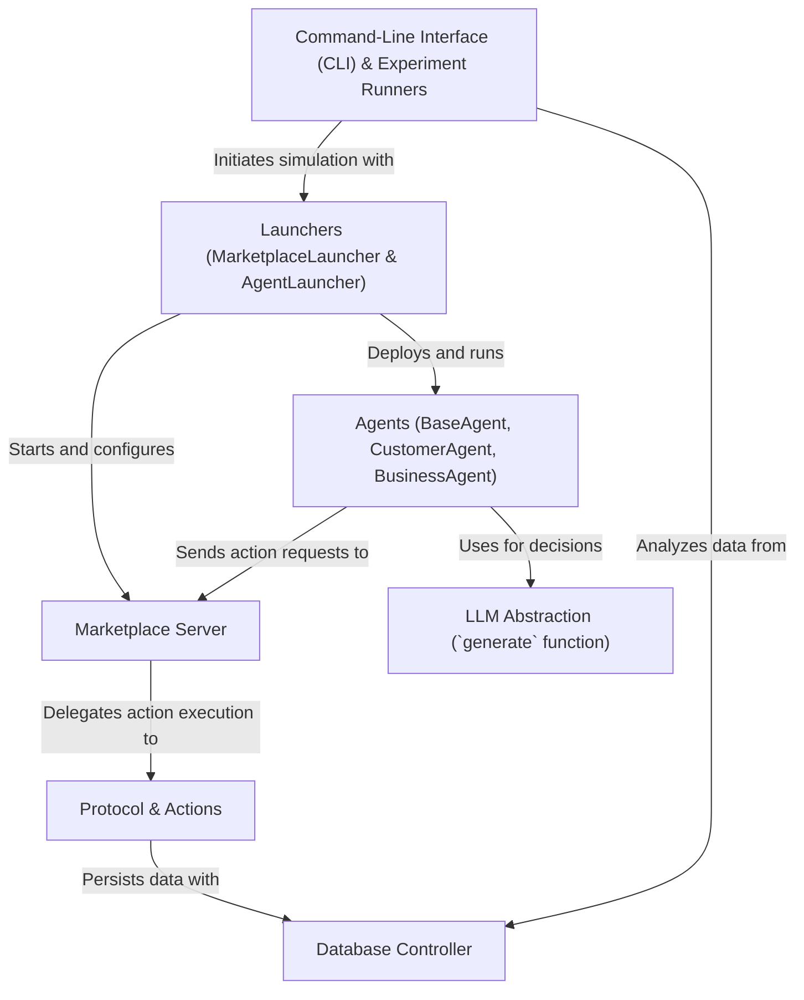

# Tutorial: magentic-marketplace

This project is a *virtual marketplace simulation* where intelligent AI agents can buy and sell goods. You can create **Customer agents** with specific needs and **Business agents** with products to sell. These agents, powered by *Large Language Models (LLMs)*, autonomously interact with each other through a central **Marketplace Server**. All actions, like sending messages or making purchases, follow a defined **Protocol** and are recorded in a **Database** for later analysis. The entire simulation is managed through a simple *command-line interface*.

**Source Repository:** [None](None)

## Chapters

1. [Agents (BaseAgent, CustomerAgent, BusinessAgent)
](01_agents__baseagent__customeragent__businessagent__.md)
2. [Protocol & Actions
](02_protocol___actions_.md)
3. [Marketplace Server
](03_marketplace_server_.md)
4. [LLM Abstraction (`generate` function)
](04_llm_abstraction___generate__function__.md)
5. [Command-Line Interface (CLI) & Experiment Runners
](05_command_line_interface__cli____experiment_runners_.md)
6. [Launchers (MarketplaceLauncher & AgentLauncher)
](06_launchers__marketplacelauncher___agentlauncher__.md)
7. [Database Controller
](07_database_controller_.md)

---

Generated by [AI Codebase Knowledge Builder](https://github.com/The-Pocket/Tutorial-Codebase-Knowledge)