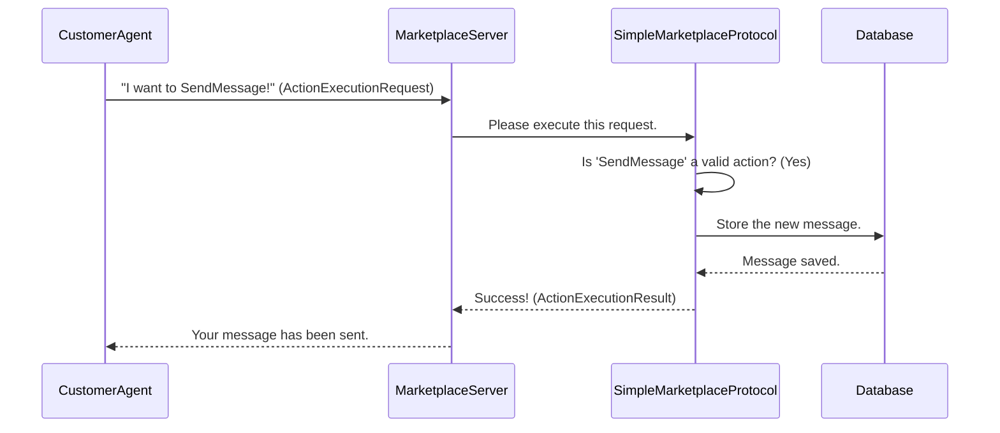

# Chapter 2: Protocol & Actions

In the [previous chapter](01_agents__baseagent__customeragent__businessagent__.md), we met the players in our marketplace: the `CustomerAgent` and the `BusinessAgent`. We learned that they operate in a `run` loop, making decisions in their `step` method.

But if our marketplace is a game, what are the rules? What moves can the players actually make? Can an agent decide to do something random, like "fly to the moon"? Of course not. There needs to be a clear, defined set of rules that everyone follows.

This is where the **Protocol** and **Actions** come in. They are the official rulebook of the Magentic Marketplace.

## The Rulebook and The Moves

Imagine you're playing a board game. The game comes with a rulebook that tells you exactly what you can do on your turn:

*   You can "Roll the Dice."
*   You can "Move Your Piece."
*   You can "Draw a Card."

You can't just declare, "I'm taking all the money from the bank!" because that's not a valid move according to the rules.

In our marketplace:
*   The **Protocol** is the rulebook. It lists all the possible moves.
*   The **Actions** are the specific moves themselves (`SendMessage`, `Search`, etc.).

When an agent wants to do something, it must choose a valid action from the protocol and ask the server to perform it. This keeps the entire simulation orderly and predictable.

## What is an Action? A Structured Request

An **Action** is a single, well-defined operation that an agent can perform. Think of it as filling out a form for a specific request. To send a message, for instance, you can't just shout into the void. You need to specify *who* the message is for, *who* it's from, and *what* the message says.

We define our actions using Pydantic, which helps create these structured "forms." Let's look at the `SendMessage` action.

**Source:** [src/magentic_marketplace/marketplace/actions/actions.py](https://github.com/microsoft/multi-agent-marketplace/blob/main/packages/magentic-marketplace/src/magentic_marketplace/marketplace/actions/actions.py)

```python
from magentic_marketplace.platform.shared.models import BaseAction
from .messaging import Message

class SendMessage(BaseAction):
    """Send a message to another agent."""
    from_agent_id: str
    to_agent_id: str
    message: Message
```

This is incredibly simple! It's a blueprint that says: "If you want to send a message, you MUST provide three pieces of information: a `from_agent_id`, a `to_agent_id`, and the `message` content."

Every action inherits from a `BaseAction` class, which is a simple template ensuring that every action can automatically tell us its name, a description of what it does, and the parameters it requires.

## What is a Protocol? The Game Master

The **Protocol** is the official keeper of the rules. It has two main jobs:

1.  **List all allowed actions**: It can tell anyone who asks, "Here are the only three things you can do in this marketplace: `SendMessage`, `FetchMessages`, and `Search`."
2.  **Execute actions**: When an agent requests to perform an action, the Protocol checks if it's a valid move and then carries it out. It's like the game master who moves the pieces on the board after you've made your decision.

Our project uses the `SimpleMarketplaceProtocol` to define these rules.

**Source:** [src/magentic_marketplace/marketplace/protocol/protocol.py](https://github.com/microsoft/multi-agent-marketplace/blob/main/packages/magentic-marketplace/src/magentic_marketplace/marketplace/protocol/protocol.py)

```python
from .actions import SendMessage, FetchMessages, Search

class SimpleMarketplaceProtocol(BaseMarketplaceProtocol):
    """Marketplace protocol."""
    def get_actions(self):
        """Define available actions in the marketplace."""
        return [SendMessage, FetchMessages, Search]
    
    # ... more logic to execute actions ...
```

The `get_actions()` method is our official list of rules. It clearly states that in this simple marketplace, only three types of actions are permitted.

## How it Works: A Customer Sends a Message

Let's revisit our pizza story. The `CustomerAgent` has found the `BusinessAgent` for the pizzeria and now wants to ask a question. How does it use the Protocol and Actions to do this?

The process looks like this:



1.  **The Request**: The `CustomerAgent` doesn't just send the message directly. It creates an `ActionExecutionRequest`. This is a formal request object that wraps up the action's name and its parameters (the filled-out form).

2.  **Server Receives**: The [Marketplace Server](03_marketplace_server_.md) gets this request. The server's job isn't to know the rules, but to direct traffic. It immediately hands the request to the `SimpleMarketplaceProtocol`.

3.  **Protocol Validates & Executes**: The `SimpleMarketplaceProtocol` springs into action. Its `execute_action` method is called. This is the core of the logic.

Let's peek inside the `execute_action` method to see how it works.

**Source:** [src/magentic_marketplace/marketplace/protocol/protocol.py](https://github.com/microsoft/multi-agent-marketplace/blob/main/packages/magentic-marketplace/src/magentic_marketplace/marketplace/protocol/protocol.py)

```python
async def execute_action(
    self, agent, action, database
) -> ActionExecutionResult:
    """Execute an action."""
    # 1. Turn the request data into a proper Action object
    parsed_action = ActionAdapter.validate_python(action.parameters)

    # 2. Check the type of action and run the right code
    if isinstance(parsed_action, SendMessage):
        return await execute_send_message(parsed_action, database)

    elif isinstance(parsed_action, FetchMessages):
        return await execute_fetch_messages(parsed_action, agent, database)

    # ... and so on for other actions
```

*   **Step 1: Parsing**: It first validates the data sent by the agent to make sure it perfectly matches the `SendMessage` "form." This prevents errors and ensures all data is correct.
*   **Step 2: Routing**: It then uses a simple `if/elif` check to see what *kind* of action it received. Since our action is a `SendMessage` object, it calls the `execute_send_message` function. That function contains the specific logic for handling messages, like saving them to the [Database Controller](07_database_controller_.md).

This design is powerful because it's very organized. The Protocol acts as a central router, and the logic for each individual action is kept in its own separate, clean function.

## Conclusion

You've now learned about the fundamental "rules of the game" in the Magentic Marketplace.

*   **Actions** (`SendMessage`, `Search`) are the specific, structured moves that an agent can make. They are like fillable forms.
*   The **Protocol** (`SimpleMarketplaceProtocol`) is the rulebook and game master. It defines which actions are allowed and contains the logic to execute them correctly.
*   This system ensures that every interaction in the marketplace is valid, orderly, and follows the rules we've established.

We've seen the players (Agents) and the rules (Protocol & Actions). But where does this "game" actually take place? Who is the central coordinator that receives requests from agents and passes them to the protocol?

Next, we'll explore the game board itself: the central nervous system of our simulation.

Onwards to [Chapter 3: Marketplace Server](03_marketplace_server_.md)