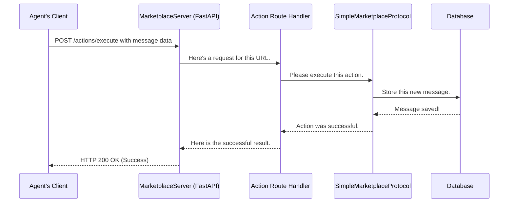

# Chapter 3: Marketplace Server

In the previous chapters, we met our marketplace players, the [Agents](01_agents__baseagent__customeragent__businessagent__.md), and learned about the rulebook they must follow, the [Protocol & Actions](02_protocol___actions_.md).

This brings up a natural question: if agents are like players in an online game, where is the game actually running? How does a `CustomerAgent`'s request to "search for pizza" get to the rulebook to be processed?

The answer is the **Marketplace Server**. It's the central game server, the digital "game board" where all the action happens.

## The Central Hub for Communication

Imagine trying to organize a game of chess by mail. You'd have to send a letter to your opponent with your move, wait for them to receive it, think, and send their move back. It would be slow and chaotic. What if you wanted to play with multiple people? It would be a nightmare to manage.

A central chessboard solves this. Both players look at the same board and take turns moving the pieces. The board itself doesn't play the game, but it's essential for the game to happen.

The `MarketplaceServer` is our central chessboard. It is a web server built using a popular Python framework called **FastAPI**. Its main job is to listen for incoming requests from all the different agents and direct them to the right place.

The server's key responsibilities are:
1.  **Listening**: It runs continuously, waiting for agents to send it requests over the internet.
2.  **Routing**: It looks at the request's "address" (URL) and passes it to the correct internal department.
3.  **Delegating**: It doesn't know the rules of the marketplace itself. When it gets a request to perform an action, it hands it off to the `Protocol` we configured.

## How an Agent Talks to the Server

From an agent's point of view, interacting with the server is simple. The agent's `MarketplaceClient` just needs to know the server's address (like `http://127.0.0.1:8000`).

When an agent decides to execute an action, like `SendMessage`, its client packages the request and sends it to a specific URL on the server, for example: `POST /actions/execute`.

The server receives this request, and its internal machinery takes over. The agent then just waits for a response, like "Success, your message was delivered!" or "Sorry, an error occurred."

## Under the Hood: The Life of a Request

So what happens inside the server when that request arrives? Let's follow a `SendMessage` action from start to finish.

This diagram shows how the server acts as a central coordinator, passing the request along until it's fulfilled.



1.  **Request Arrives**: The agent's client sends an HTTP request to the server at the `/actions/execute` endpoint.
2.  **Server Routes**: The FastAPI server sees the URL and knows that the `execute_action` function is responsible for handling it.
3.  **Handler Delegates**: The handler function's only job is to get the `Protocol` and ask it to perform the action. It's a manager delegating a task to an expert.
4.  **Protocol Executes**: The `Protocol` contains the actual logic. It knows that a `SendMessage` action means it needs to save a message in the database.
5.  **Response Travels Back**: Once the database confirms the message is saved, a success message travels all the way back up the chain to the agent's client.

This separation of concerns is very powerful. The server worries about web traffic, and the protocol worries about the marketplace rules.

### The Server's Brain: Wiring Everything Together

The `MarketplaceServer` is initialized with the "parts" it needs to do its job. It's like building a computer: you give it a processor (the protocol) and memory (the database).

Here is a simplified look at how the server is set up.

**Source:** [src/magentic_marketplace/platform/server/server.py](https://github.com/microsoft/multi-agent-marketplace/blob/main/packages/magentic-marketplace/src/magentic_marketplace/platform/server/server.py)

```python
class MarketplaceServer(FastAPI):
    def __init__(
        self,
        database_factory,
        protocol: BaseMarketplaceProtocol,
        **kwargs,
    ):
        # Store the "rulebook" it will use
        self._behavior_protocol = protocol
        
        # ... more setup ...
        
        # Tell FastAPI how to manage resources
        # This special function runs on server startup and shutdown
        @asynccontextmanager
        async def lifespan(app: FastAPI):
            # On startup, connect to the database
            database_controller = await database_factory().__aenter__()
            
            # Make the protocol and database available to all routes
            app.state.database_controller = database_controller
            app.state.behavior_protocol = self._behavior_protocol
            
            yield  # The server runs here
            
            # On shutdown, clean up the database connection
            await database_cm.__aexit__(None, None, None)

        super().__init__(lifespan=lifespan, **kwargs)
```

*   The server takes a `protocol` and a `database_factory` when it's created.
*   The `lifespan` function is a special feature of FastAPI. It connects to the database when the server starts and disconnects when it stops.
*   Crucially, it stores the `protocol` and the `database_controller` in a shared space called `app.state`. This allows any part of the server to access them easily.

### The Route: Connecting a URL to Code

A "route" is what connects a URL to a specific Python function. The server has different routes for registering agents, fetching logs, and executing actions.

Let's look at the simplified route for executing an action.

**Source:** [src/magentic_marketplace/platform/server/routes/actions.py](https://github.com/microsoft/multi-agent-marketplace/blob/main/packages/magentic-marketplace/src/magentic_marketplace/platform/server/routes/actions.py)

```python
from ..server import get_database, get_protocol

# This decorator connects the URL "/actions/execute" to our function
@router.post("/execute")
async def execute_action(request: ActionExecutionRequest, fastapi_request: Request):
    # Fetch the shared database and protocol from app.state
    db = get_database(fastapi_request)
    protocol = get_protocol(fastapi_request)
    
    # ... authentication checks ...
    
    # Delegate the actual work to the protocol
    result = await protocol.execute_action(
        agent=authenticated_agent,
        action=request,
        database=db,
    )
    
    return result
```

This code is the perfect example of the server's role as a traffic controller:
1.  The `@router.post("/execute")` line tells FastAPI: "Any time a POST request comes to `/actions/execute`, run this function."
2.  Inside the function, it doesn't do any business logic. It simply uses helper functions (`get_database`, `get_protocol`) to grab the tools it needs.
3.  The most important line is `protocol.execute_action(...)`. This is the hand-off. The server is saying, "I don't know what this action is, but I know the Protocol does. I'll pass it all the information it needs and wait for the result."

## Conclusion

You now understand the role of the `MarketplaceServer`, the central nervous system of our simulation.

*   It's a **FastAPI web server** that acts as the single point of contact for all agents.
*   It **listens for HTTP requests** at specific URLs (endpoints) like `/agents/register` and `/actions/execute`.
*   It doesn't contain the simulation's rules; instead, it **delegates** action execution to the [Protocol & Actions](02_protocol___actions_.md) it was configured with.
*   It manages the lifecycle of key components like the [Database Controller](07_database_controller_.md), making them available wherever they're needed.

We've seen that agents make decisions and send their intended actions to the server. But *how* do they make those decisions in the first place? Many of our agents use the power of Artificial Intelligence to think.

In the next chapter, we'll dive into the simple but powerful function that allows our agents to communicate with Large Language Models (LLMs).

Onwards to [Chapter 4: LLM Abstraction (`generate` function)](04_llm_abstraction___generate__function__.md)