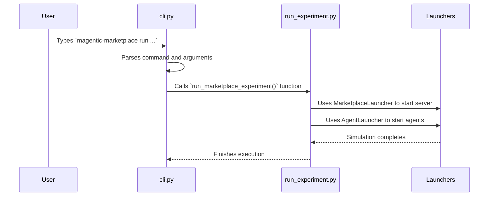

# Chapter 5: Command-Line Interface (CLI) & Experiment Runners

In the [previous chapter](04_llm_abstraction___generate__function__.md), we gave our agents a brain using the `generate` function, allowing them to make intelligent decisions. We now have all the core components of our simulation: thinking [Agents](01_agents__baseagent__customeragent__businessagent__.md), a central [Server](03_marketplace_server_.md), and a clear [Protocol](02_protocol___actions_.md).

But how do we bring all these pieces together and actually *run* a simulation? We need a way to press the "start" button, and later, a way to see the results. This is where our project's control panel comes in: the **Command-Line Interface (CLI)**.

## Your Mission Control Center

Imagine you're launching a rocket. You don't just push a single button; you have a whole control panel with different commands: `start-countdown`, `check-systems`, `analyze-telemetry`. Each command kicks off a specific, complex procedure.

The `magentic-marketplace` CLI is your mission control center for running simulations. It's a tool you use from your computer's terminal (the black-and-white text window) to manage the entire lifecycle of an experiment. Instead of clicking on icons, you type simple commands to:

*   **`run`**: Launch a brand new simulation with a specific set of customers and businesses.
*   **`list`**: See all the simulation experiments you've run in the past.
*   **`analyze`**: Calculate and display key results from a completed experiment.
*   **`audit`**: Perform a deep check to see if agents behaved as expected.

This approach is powerful because it's automatable and precise. You can write scripts to run many experiments and compare their results, which is essential for research and development.

## Using the CLI: From Launch to Analysis

Let's walk through the two most common commands you'll use.

### 1. Running a New Experiment

First, you need to tell the system *what* to simulate. This is done by organizing your agent profiles into a simple folder structure. For example, you might have a `pizza-scenario` folder:

```
pizza-scenario/
├── businesses/
│   └── pizzeria.yaml
└── customers/
    └── vegetarian_shopper.yaml
```

To start the simulation, you open your terminal and run a single command:

```bash
magentic-marketplace run ./pizza-scenario --experiment-name pizza_run_01
```

Let's break that down:
*   `magentic-marketplace`: The name of our command-line tool.
*   `run`: The specific command we want to execute. We're telling it to start a new simulation.
*   `./pizza-scenario`: The path to our data directory. The tool will look inside for the `businesses/` and `customers/` subfolders.
*   `--experiment-name pizza_run_01`: A unique name for this specific simulation. All the data generated (messages, actions, logs) will be stored under this name, so we can easily find it later.

When you hit Enter, the system springs to life! It will start the server, launch all the agents, and let them interact until the simulation is complete.

### 2. Analyzing the Results

Once the experiment is finished, all the data is saved in a database. How do you see what happened? Did the customer find a pizza? How much money did the pizzeria make?

You use the `analyze` command with the name you gave your experiment:

```bash
magentic-marketplace analyze pizza_run_01
```

The tool will connect to the database, pull all the data for `pizza_run_01`, calculate important metrics, and print a beautiful summary report right in your terminal. You might see something like this:

```
MARKETPLACE SIMULATION ANALYTICS REPORT
============================================================

SIMULATION OVERVIEW:
Found 1 customers and 1 businesses
Total actions executed: 25
Total messages sent: 8

TRANSACTION SUMMARY:
Order proposals created: 1
Payments made: 1
Average paid order value: $15.99

... more details ...
```

This simple `run` -> `analyze` workflow is the core of how you'll interact with the Magentic Marketplace.

## Under the Hood: The CLI and the Runners

How does typing `run` in the terminal actually make a whole marketplace simulation happen? The magic lies in a clean separation between the CLI itself and the scripts that do the heavy lifting, called **Experiment Runners**.

*   **The CLI (`cli.py`)**: This file is just a smart dispatcher. Its only job is to understand the commands you type (like `run` or `analyze`) and call the correct Python script to handle it. It's like a receptionist who directs your call to the right department.
*   **The Runners (`run_experiment.py`, `run_analytics.py`)**: These are the "departments." Each one is a specialist script responsible for a single, major task. `run_experiment.py` knows everything about starting servers and agents, while `run_analytics.py` is an expert at querying the database and calculating metrics.

Here's how it works when you run an experiment:



Let's look at the code for these two key parts.

### The Dispatcher: `cli.py`

This file uses Python's standard `argparse` library to define the commands and their arguments. It's like creating a menu of options for the user.

**Source:** [src/magentic_marketplace/cli.py](https://github.com/microsoft/multi-agent-marketplace/blob/main/packages/magentic-marketplace/src/magentic_marketplace/cli.py)

```python
def main():
    parser = argparse.ArgumentParser(...)
    subparsers = parser.add_subparsers(dest="command")

    # Define the "run" command
    run_parser = subparsers.add_parser("run", help="Run an experiment")
    run_parser.add_argument("data_dir", type=str, help="Path to data")
    # ... more arguments for 'run' ...
    run_parser.set_defaults(func=run_experiment_command) # Link to handler

    # Define the "analyze" command
    analyze_parser = subparsers.add_parser("analyze", help="Analyze data")
    analyze_parser.add_argument("database_name", help="Name of experiment")
    # ... more arguments for 'analyze' ...
    analyze_parser.set_defaults(func=run_analysis_command) # Link to handler

    # Parse what the user typed and call the linked function
    args = parser.parse_args()
    args.func(args)
```
The key lines are `set_defaults(func=...)`. This cleverly attaches the correct handler function (like `run_experiment_command`) to each command. When the user types `run`, the final `args.func(args)` line automatically calls `run_experiment_command`.

### The Runner: `run_experiment.py`

This is where the actual simulation is orchestrated. The handler function in `cli.py` calls a main function in this file, which performs the step-by-step process of setting up and running the simulation.

**Source:** [src/magentic_marketplace/experiments/run_experiment.py](https://github.com/microsoft/multi-agent-marketplace/blob/main/packages/magentic-marketplace/src/magentic_marketplace/experiments/run_experiment.py)

```python
async def run_marketplace_experiment(data_dir, experiment_name, ...):
    # 1. Load agent profiles from the data directory
    businesses = load_businesses_from_yaml(...)
    customers = load_customers_from_yaml(...)

    # 2. Set up the server launcher
    marketplace_launcher = MarketplaceLauncher(
        protocol=SimpleMarketplaceProtocol(),
        database_factory=..., # Sets up the database connection
    )

    # 3. Start the server
    async with marketplace_launcher:
        # 4. Create all the agent objects
        business_agents = [BusinessAgent(...) for b in businesses]
        customer_agents = [CustomerAgent(...) for c in customers]
        
        # 5. Start the agents and wait for them to finish
        async with AgentLauncher(...) as agent_launcher:
            await agent_launcher.run_agents_with_dependencies(...)
```
This script acts as the master conductor. It reads the configuration, prepares all the components, and then uses a special tool called [Launchers (MarketplaceLauncher & AgentLauncher)](06_launchers__marketplacelauncher___agentlauncher__.md) to bring the server and agents to life in the correct order.

## Conclusion

You've now seen the control panel for our entire simulation system!

*   The **Command-Line Interface (CLI)** is the main entry point for users, providing simple commands like `run` and `analyze`.
*   The CLI acts as a **dispatcher**, delegating tasks to specialized scripts called **Experiment Runners**.
*   `run_experiment.py` is responsible for setting up and launching a full simulation.
*   `run_analytics.py` is responsible for querying a completed simulation's data and generating reports.

This separation of concerns makes the system clean and easy to manage. The CLI provides a simple user interface, while the runners contain the complex logic for each major task.

We saw that the `run_experiment.py` script relied heavily on `MarketplaceLauncher` and `AgentLauncher` to actually start the server and agents. What are these launchers, and how do they manage starting and stopping complex processes? We'll find out in the next chapter.

Onwards to [Chapter 6: Launchers (MarketplaceLauncher & AgentLauncher)](06_launchers__marketplacelauncher___agentlauncher__.md)